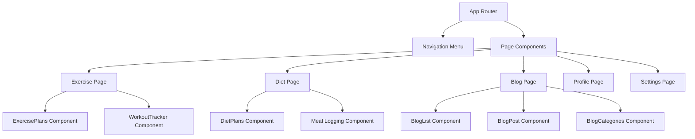

# Design Document: Missing Pages

## Overview

The Missing Pages system implements the remaining frontend pages required to complete the FEMbalance application structure. This includes Exercise, Diet, Blog, Profile, and Settings pages that integrate existing components and provide complete user navigation experience.

## Architecture

The missing pages follow React functional component architecture with:

1. **Page Components**: Main page containers with routing integration
2. **Component Integration**: Reuse of existing wellness, blog, and user components  
3. **Navigation System**: Updated routing and navigation menu
4. **Responsive Design**: Mobile-first responsive layouts



## Components and Interfaces

### Page Components

#### Exercise Page
- Integrates existing ExercisePlans and WorkoutTracker components
- Provides exercise analytics and progress tracking
- Includes workout history and goal setting

#### Diet Page  
- Integrates existing DietPlans component
- Adds meal logging and nutrition tracking interface
- Provides nutrition analytics and dietary goal management

#### Blog Page
- Integrates existing BlogList, BlogPost, and BlogCategories components
- Adds search and filtering functionality
- Provides educational content navigation

#### Profile Page
- Displays user information and health metrics
- Allows editing of personal data and preferences
- Shows health progress summaries and data export options

#### Settings Page
- Provides application configuration options
- Includes notification and privacy settings
- Offers account management and security controls

### Navigation Integration

#### Updated Navigation Menu
- Adds links to all new pages
- Implements active page highlighting
- Maintains responsive navigation behavior

#### Routing Configuration
- Adds routes for /exercise, /diet, /blog, /profile, /settings
- Implements protected routes for authenticated pages
- Provides proper error handling and 404 pages

## Data Models

### Page State Management
```javascript
// Page-level state for navigation and layout
{
  currentPage: String,
  navigationOpen: Boolean,
  breadcrumbs: [String],
  pageTitle: String,
  pageMetadata: {
    description: String,
    keywords: [String]
  }
}
```

### User Profile Data
```javascript
// Extended user profile for Profile page
{
  personalInfo: {
    name: String,
    email: String,
    dateOfBirth: Date,
    location: String
  },
  healthMetrics: {
    height: Number,
    weight: Number,
    activityLevel: String,
    healthGoals: [String]
  },
  preferences: {
    units: String, // 'metric' or 'imperial'
    notifications: Boolean,
    privacy: String
  }
}
```

### Settings Configuration
```javascript
// Application settings data
{
  notifications: {
    cycleReminders: Boolean,
    workoutReminders: Boolean,
    mealReminders: Boolean,
    emailUpdates: Boolean
  },
  privacy: {
    dataSharing: Boolean,
    analyticsTracking: Boolean,
    profileVisibility: String
  },
  account: {
    twoFactorAuth: Boolean,
    dataRetention: String,
    exportFormat: String
  }
}
```

## Correctness Properties

*A property is a characteristic or behavior that should hold true across all valid executions of a system-essentially, a formal statement about what the system should do. Properties serve as the bridge between human-readable specifications and machine-verifiable correctness guarantees.*

### Property 1: Page Route Accessibility
*For any* valid page route (/exercise, /diet, /blog, /profile, /settings), navigation should successfully render the corresponding page component
**Validates: Requirements 1.1, 2.1, 3.1, 4.1, 5.1**

### Property 2: Component Integration Completeness
*For any* page that requires specific components, all required components should be properly integrated and functional
**Validates: Requirements 1.2, 2.2, 3.2**

### Property 3: Navigation Menu Consistency
*For any* page navigation, the navigation menu should include all required page links and highlight the current active page
**Validates: Requirements 6.1, 6.2**

### Property 4: Responsive Design Compliance
*For any* page and viewport size, the page should maintain responsive design and usability standards
**Validates: Requirements 1.4, 2.4, 3.4**

### Property 5: Profile Data Persistence
*For any* profile information update, the changes should be saved and retrievable in subsequent page visits
**Validates: Requirements 4.2**

### Property 6: Settings Configuration Persistence
*For any* settings modification, the configuration should be applied immediately and persist across sessions
**Validates: Requirements 5.2, 5.3**

### Property 7: Navigation State Consistency
*For any* page transition, the navigation state should be maintained and updated correctly
**Validates: Requirements 6.3, 6.4**

## Error Handling

### Route Protection
- Authenticated routes redirect to login if user not authenticated
- Invalid routes display 404 error page with navigation options
- Network errors show appropriate error messages with retry options

### Component Integration
- Missing component dependencies show graceful fallback UI
- API failures display error states with refresh capabilities
- Loading states prevent user interaction during data fetching

### Form Validation
- Profile and settings forms validate input before submission
- Invalid data shows specific error messages
- Form state is preserved during validation errors

## Testing Strategy

The missing pages feature will use a dual testing approach with unit tests for component behavior and property-based tests for universal correctness.

### Unit Testing
Unit tests will focus on:
- Page component rendering and layout
- Navigation menu functionality and active state
- Form submission and validation
- Component integration and prop passing
- Responsive design breakpoints

### Property-Based Testing
Property-based tests will validate universal properties using **fast-check** library:
- Each property test will run a minimum of 100 iterations
- Tests will verify routing, navigation, and data persistence
- Each test tagged with: **Feature: missing-pages, Property {number}: {property_text}**

### Test Configuration
- Unit tests: Jest with React Testing Library
- Property tests: fast-check with Jest integration
- E2E tests: Cypress for full page navigation flows
- Coverage target: 90% for all page components