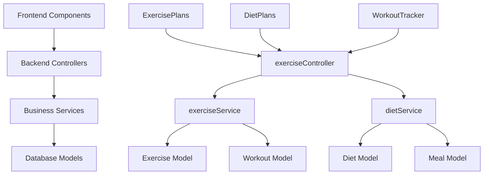

# Design Document: Wellness Tracking

## Overview

The Wellness Tracking system provides comprehensive exercise and diet management capabilities within the FEMbalance application. It consists of frontend React components for user interaction, backend Node.js services for data management, and integration points with existing cycle tracking and PCOS risk assessment features.

## Architecture

The wellness tracking feature follows a three-tier architecture:

1. **Presentation Layer**: React components for exercise plans, diet plans, and workout tracking
2. **Business Logic Layer**: Node.js controllers and services for wellness data processing
3. **Data Layer**: MongoDB collections for storing exercise, diet, and workout data



## Components and Interfaces

### Frontend Components

#### ExercisePlans Component
- Displays available exercise plans with filtering and categorization
- Provides detailed view of individual exercise plans
- Integrates with workout tracker for plan execution

#### DietPlans Component  
- Shows available diet plans with nutritional information
- Allows customization based on dietary restrictions
- Provides meal scheduling and recipe viewing

#### WorkoutTracker Component
- Logs completed workouts with exercise details
- Tracks workout duration, intensity, and progress
- Displays workout history and analytics

### Backend Controllers

#### exerciseController
- `GET /api/wellness/exercise-plans` - Retrieve available exercise plans
- `POST /api/wellness/workouts` - Log completed workout
- `GET /api/wellness/workouts` - Get user's workout history
- `GET /api/wellness/exercise-analytics` - Get exercise progress analytics

#### dietController (New)
- `GET /api/wellness/diet-plans` - Retrieve available diet plans
- `POST /api/wellness/meals` - Log meal intake
- `GET /api/wellness/meals` - Get user's meal history
- `GET /api/wellness/nutrition-analytics` - Get nutrition analytics

### Backend Services

#### exerciseService
- Manages exercise plan data and user workout tracking
- Calculates exercise progress and analytics
- Integrates with cycle data for hormonal health insights

#### dietService (New)
- Manages diet plan data and meal logging
- Calculates nutritional values and tracks dietary goals
- Provides personalized nutrition recommendations

## Data Models

### Exercise Model
```javascript
{
  _id: ObjectId,
  name: String,
  category: String, // 'cardio', 'strength', 'yoga', 'hiit'
  difficulty: String, // 'beginner', 'intermediate', 'advanced'
  duration: Number, // minutes
  instructions: [String],
  equipment: [String],
  targetMuscles: [String],
  caloriesBurned: Number,
  createdAt: Date,
  updatedAt: Date
}
```

### Workout Model (New)
```javascript
{
  _id: ObjectId,
  userId: ObjectId,
  exerciseId: ObjectId,
  date: Date,
  duration: Number, // actual duration in minutes
  intensity: String, // 'low', 'medium', 'high'
  caloriesBurned: Number,
  notes: String,
  cycleDay: Number, // integration with cycle tracking
  createdAt: Date
}
```

### Diet Model (New)
```javascript
{
  _id: ObjectId,
  name: String,
  category: String, // 'pcos-friendly', 'weight-loss', 'maintenance'
  description: String,
  meals: [{
    type: String, // 'breakfast', 'lunch', 'dinner', 'snack'
    name: String,
    ingredients: [String],
    instructions: String,
    nutrition: {
      calories: Number,
      protein: Number,
      carbs: Number,
      fat: Number,
      fiber: Number
    }
  }],
  totalCalories: Number,
  createdAt: Date,
  updatedAt: Date
}
```

### Meal Model (New)
```javascript
{
  _id: ObjectId,
  userId: ObjectId,
  date: Date,
  type: String, // 'breakfast', 'lunch', 'dinner', 'snack'
  foods: [{
    name: String,
    quantity: Number,
    unit: String,
    calories: Number,
    nutrition: {
      protein: Number,
      carbs: Number,
      fat: Number,
      fiber: Number
    }
  }],
  totalCalories: Number,
  cycleDay: Number, // integration with cycle tracking
  createdAt: Date
}
```
## Correctness Properties

*A property is a characteristic or behavior that should hold true across all valid executions of a system-essentially, a formal statement about what the system should do. Properties serve as the bridge between human-readable specifications and machine-verifiable correctness guarantees.*

### Property 1: Exercise Plan Categorization
*For any* exercise plan retrieval request, all returned exercise plans should be properly categorized by type and difficulty with valid category values
**Validates: Requirements 1.1**

### Property 2: Exercise Plan Detail Completeness
*For any* valid exercise plan ID, the detailed view should contain all required fields including instructions, duration, and equipment
**Validates: Requirements 1.2**

### Property 3: Exercise Plan Persistence
*For any* user selection of an exercise plan, the selection should be stored and retrievable in subsequent requests
**Validates: Requirements 1.4**

### Property 4: Workout Logging Data Integrity
*For any* workout logging request with valid exercise type, duration, and intensity, the data should be stored with all provided fields intact
**Validates: Requirements 2.1**

### Property 5: Workout Timestamp Persistence
*For any* logged workout, the stored data should include a valid timestamp indicating when the workout was logged
**Validates: Requirements 2.2**

### Property 6: Workout Statistics Calculation
*For any* user's workout history, the displayed statistics should accurately reflect the aggregated data from all logged workouts
**Validates: Requirements 2.3**

### Property 7: Workout Summary Aggregation
*For any* time period (weekly or monthly), workout summaries should correctly aggregate all workouts within that period
**Validates: Requirements 2.4**

### Property 8: Diet Plan Nutritional Information
*For any* diet plan retrieval request, all returned diet plans should include complete nutritional information for each meal
**Validates: Requirements 3.1**

### Property 9: Diet Plan Detail Completeness
*For any* valid diet plan ID, the detailed view should contain meal schedules and complete recipe information
**Validates: Requirements 3.2**

### Property 10: Diet Plan Filtering
*For any* dietary restriction filter, only diet plans compatible with those restrictions should be returned
**Validates: Requirements 3.3**

### Property 11: Nutritional Value Calculation
*For any* set of food items with known nutritional values, the total nutritional calculation should equal the sum of individual item values
**Validates: Requirements 3.4**

### Property 12: Meal Logging Data Integrity
*For any* meal logging request with food items, portions, and timing, all provided data should be stored accurately
**Validates: Requirements 4.1**

### Property 13: Automatic Nutritional Calculation
*For any* meal entry with food items and portions, nutritional values should be automatically calculated and stored
**Validates: Requirements 4.2**

### Property 14: Nutrition Summary Accuracy
*For any* time period, nutritional summaries should accurately aggregate all meal data within that period
**Validates: Requirements 4.3**

### Property 15: Nutritional Goal Alert Logic
*For any* user with defined nutritional goals, alerts should be triggered when actual intake falls below goal thresholds
**Validates: Requirements 4.4**

### Property 16: Cycle Data Correlation
*For any* wellness data entry, if cycle information is available, it should be included in the wellness data record
**Validates: Requirements 5.1**

### Property 17: Health Insight Data Inclusion
*For any* health insight generation, the analysis should include both exercise and diet pattern data when available
**Validates: Requirements 5.2**

### Property 18: Cycle-Based Recommendations
*For any* recommendation generation, if both cycle phase and wellness data are available, recommendations should consider both data sources
**Validates: Requirements 5.3**

### Property 19: Comprehensive Data Export
*For any* health data export request, the exported data should include all available wellness information (exercise, diet, workouts, meals)
**Validates: Requirements 5.4**

### Property 20: Analytics Chart Data Accuracy
*For any* analytics request, the returned chart data should accurately represent the user's exercise and diet progress over time
**Validates: Requirements 6.1**

### Property 21: Wellness Metrics Calculation
*For any* user with wellness data, calculated metrics should accurately reflect trends and patterns in the historical data
**Validates: Requirements 6.2**

### Property 22: Conditional Insight Generation
*For any* user with sufficient wellness data (minimum threshold), personalized insights should be generated and returned
**Validates: Requirements 6.3**

### Property 23: Goal Progress Tracking
*For any* user with defined wellness goals, progress indicators should accurately reflect the percentage of goal completion based on actual vs target values
**Validates: Requirements 6.4**

## Error Handling

### Input Validation
- All API endpoints validate required fields and data types
- Exercise and diet plan IDs are validated for existence
- Nutritional values are validated for reasonable ranges
- Date fields are validated for proper format and logical constraints

### Data Consistency
- Workout logging ensures exercise plan exists before creating workout record
- Meal logging validates food items against nutritional database
- User authentication is verified for all wellness data operations
- Cycle day correlation is validated against user's cycle data

### Error Responses
- 400 Bad Request for invalid input data
- 401 Unauthorized for unauthenticated requests
- 404 Not Found for non-existent exercise/diet plans
- 422 Unprocessable Entity for business logic violations
- 500 Internal Server Error for system failures

## Testing Strategy

The wellness tracking feature will be validated using a dual testing approach combining unit tests for specific scenarios and property-based tests for universal correctness properties.

### Unit Testing
Unit tests will focus on:
- API endpoint response formats and status codes
- Database model validation and constraints
- Service layer business logic for specific scenarios
- Integration points with existing cycle tracking system
- Error handling for edge cases and invalid inputs

### Property-Based Testing
Property-based tests will validate universal properties using **fast-check** library for JavaScript:
- Each property test will run a minimum of 100 iterations
- Tests will generate random but valid input data to verify properties hold across all inputs
- Each test will be tagged with: **Feature: wellness-tracking, Property {number}: {property_text}**
- Properties will test data integrity, calculation accuracy, and business rule compliance

### Test Configuration
- Unit tests: Jest framework with supertest for API testing
- Property tests: fast-check library with Jest integration
- Database: MongoDB Memory Server for isolated testing
- Coverage target: 90% code coverage for all wellness-related modules
- CI/CD: Tests run on every pull request and deployment